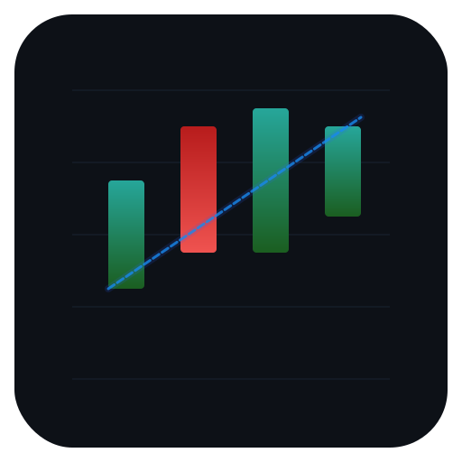

<p align="center">
  
</p>

<h1 align="center">fin-charter</h1>

<p align="center">Ultra-fast, tree-shakeable financial charting library for the browser.</p>

**[Live Storybook Documentation & Examples](https://itssumitrai.github.io/fin-charter/)**

## Key Features

- **Ultra-fast canvas rendering** — direct 2D canvas drawing, no virtual DOM
- **Tiny bundle** — core is under 15 KB gzipped; unused chart types tree-shake away
- **Tree-shakeable** — `"sideEffects": false` ES module package
- **20 chart types** — Candlestick, Line, Area, Bar (OHLC), Baseline, Hollow Candle, Histogram, Heikin-Ashi, Step Line, Colored Line, Colored Mountain, HLC Area, High-Low, Column, Volume Candle, Baseline Delta Mountain, Renko, Kagi, Line Break, Point & Figure
- **30 built-in indicators** — SMA, EMA, Bollinger Bands, RSI, MACD, VWAP, Stochastic, ATR, ADX, OBV, Williams %R, Volume, Ichimoku Cloud, Parabolic SAR, Keltner Channel, Donchian Channel, CCI, Pivot Points, Aroon, Awesome Oscillator, Chaikin MF, Coppock, Elder Force, TRIX, Supertrend, VWMA, Choppiness, MFI, ROC, Linear Regression
- **Chart-managed indicators** — `chart.addIndicator('rsi', { source: series })` with auto-compute and auto-pane creation
- **Multi-pane layout** — indicator panes with draggable dividers and independent price scales
- **Interactive HUD** — series/indicator management with visibility toggle, settings editor, and remove
- **TV-style global HUD collapse** — chevron button collapses all indicator rows at once
- **Context menu** — right-click drawings for Edit/Duplicate/Remove/Z-order; right-click chart for Reset Zoom/Scroll to Latest; right-click indicator pane for Settings/Hide/Remove
- **TradingView-compatible plugin system** — `ISeriesPrimitive` / `IPanePrimitive` interfaces
- **Real-time data** — `series.update(bar)` appends or overwrites the last bar in O(1)
- **Drawing tools** — 16 built-in types (horizontal line, vertical line, trendline, fibonacci, rectangle, text, ray, arrow, channel, ellipse, pitchfork, fib projection, fib arc, fib fan, crossline, measurement); extensible via `registerDrawingType()`
- **Comparison mode** — normalise multiple series to percentage change for side-by-side performance comparison
- **Heikin-Ashi** — `chart.addSeries({ type: 'heikin-ashi' })` with automatic OHLC-to-HA transform
- **Market sessions** — define pre/post-market windows with background highlights; filter bars by session
- **Chart state save/restore** — `exportState()` / `importState()` round-trips the full chart configuration
- **Data pagination** — `series.prependData()` + `barsInLogicalRange()` + `subscribeVisibleRangeChange()` for infinite-history scrolling
- **Event markers** — `series.setEvents()` places interactive earnings/dividend/news markers on bars
- **Periodicity model** — `setPeriodicity()` / `subscribePeriodicityChange()` for interval switching with data-reload hooks
- **OHLC aggregation** — `aggregateOHLC(store, intervalSec)` for client-side timeframe resampling
- **Auto-fit on load** — chart automatically fits all data to the viewport on first paint, filling edge-to-edge with no gaps
- **Screenshot export** — `chart.takeScreenshot()` composites all panes to a canvas with the chart's background color, matching the live appearance
- **TypeScript-first** — full type definitions included

## Installation

```bash
npm install @itssumitrai/fin-charter
```

## Quick Start

```ts
import { createChart } from '@itssumitrai/fin-charter';

const chart = createChart(document.getElementById('chart')!, {
  width: 800,
  height: 400,
});

const series = chart.addSeries({ type: 'candlestick' });

series.setData([
  { time: 1700000000, open: 100, high: 110, low: 95,  close: 107 },
  { time: 1700086400, open: 107, high: 115, low: 104, close: 112 },
  { time: 1700172800, open: 112, high: 118, low: 108, close: 109 },
]);
```

## Chart Types

| Type | Method | Description |
|---|---|---|
| Candlestick | `addSeries({ type: 'candlestick' })` | OHLC candles with filled body and wick |
| Line | `addSeries({ type: 'line' })` | Close-price polyline |
| Area | `addSeries({ type: 'area' })` | Close-price line with gradient fill below |
| Bar (OHLC) | `addSeries({ type: 'bar' })` | Traditional OHLC tick bars |
| Baseline | `addSeries({ type: 'baseline' })` | Two-color fill above/below a base price |
| Hollow Candle | `addSeries({ type: 'hollow-candle' })` | Up candles hollow (outline only), down candles filled |
| Histogram | `addSeries({ type: 'histogram' })` | Vertical bars from the bottom; useful for volume |
| Heikin-Ashi | `addSeries({ type: 'heikin-ashi' })` | Smoothed OHLC candles with automatic HA transform |
| Step Line | `addSeries({ type: 'step-line' })` | Horizontal-then-vertical line segments |
| Colored Line | `addSeries({ type: 'colored-line' })` | Line with per-bar color control |
| Colored Mountain | `addSeries({ type: 'colored-mountain' })` | Area chart with per-bar color control |
| HLC Area | `addSeries({ type: 'hlc-area' })` | High-low-close area band |
| High-Low | `addSeries({ type: 'high-low' })` | High-low range bars |
| Column | `addSeries({ type: 'column' })` | Vertical column bars |
| Volume Candle | `addSeries({ type: 'volume-candle' })` | Candles with width proportional to volume |
| Baseline Delta Mountain | `addSeries({ type: 'baseline-delta-mountain' })` | Filled delta area around baseline |
| Renko | `addSeries({ type: 'renko' })` | Price-action-only brick charts |
| Kagi | `addSeries({ type: 'kagi' })` | Trend reversal line charts |
| Line Break | `addSeries({ type: 'line-break' })` | N-line break charts |
| Point & Figure | `addSeries({ type: 'point-figure' })` | X and O column charts |

> All chart types use the unified `addSeries({ type })` API.

## Bundle Size (measured)

| Entry point | Size (gzip) |
|---|---|
| `@itssumitrai/fin-charter` (core) | ~13.8 KB |
| Full bundle (all chart types + indicators) | ~35.9 KB |

## Bundle Size Comparison

How does fin-charter compare to other financial charting libraries with technical indicator support?

| Library | Min+Gzip | Indicators | # Indicators | Tree-shakeable | License |
|---|---|---|---|---|---|
| **fin-charter** | **~35.9 KB** (full) | **Built-in** | **30** | **Yes** | MIT |
| [klinecharts](https://github.com/klinecharts/KLineChart) | 52.6 KB | Built-in | ~27 | No | Apache-2.0 |
| [lightweight-charts](https://github.com/nicehash/lightweight-charts) | 57.1 KB | No (plugin needed) | 0 | No | Apache-2.0 |
| [chart.js + financial](https://github.com/chartjs/chartjs-chart-financial) | ~70.1 KB | No (charts only) | 0 | Yes | MIT |
| [highcharts](https://www.highcharts.com/products/stock/) (core + stock) | ~150 KB+ | Built-in | 65 | No | Commercial |
| [d3](https://github.com/d3/d3) + [d3fc](https://github.com/d3fc/d3fc) | ~125.6 KB | Basic set | ~8 | Yes | MIT / MIT |
| [apexcharts](https://github.com/apexcharts/apexcharts.js) | 134.7 KB | Via add-on | ~15 | Partial | MIT |
| [echarts](https://github.com/apache/echarts) | 353.4 KB (full) | Minimal | ~1 | Yes | Apache-2.0 |
| [plotly.js](https://github.com/plotly/plotly.js) (finance) | 398.5 KB | No | 0 | No | MIT |
| [anychart](https://github.com/AnyChart/AnyChart) | 731.4 KB | Built-in | 20+ | No | Commercial |

> Sizes measured via [bundlephobia](https://bundlephobia.com) (minified + gzipped). Only libraries with at least some financial charting capability are included. fin-charter's full bundle includes all 20 chart types and 30 indicators.

## Documentation

All documentation is available in the **[Live Storybook](https://itssumitrai.github.io/fin-charter/)**:

- Getting Started
- API Reference
- Indicators & Custom Indicators
- Drawing Tools
- Data Integration & Data Feed
- Plugin System
- Performance & WebGL
- CSS Theming
- Accessibility & RTL Support
- Touch Gestures
- And more...

## License

MIT
